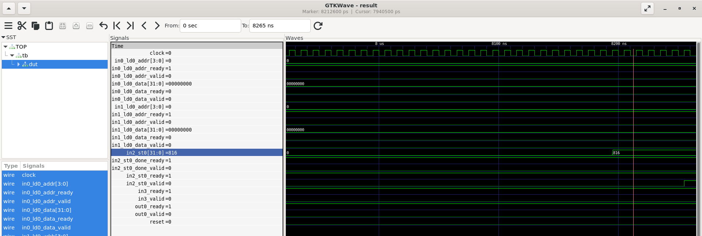

# Deliverable 2b: PyTorch simulation trace, SystemVerilog testbench, and comparison

In 2a, we generated 'matmul.sv'. 2b validates functional equivalence
against PyTorch by embedding the PyTorch-computed reference into the
testbench data.

# Scope

- This deliverable validates only one fixed 16x16 test case.
- The vectors are fixed in 'sim/testvectors.json'. No random
  or property-based generation is used.
- The check is a single expected-vs-got comparison

## Explanation

Inputs: 'sim/testvectors.json'

- 'gentbdata.py' reads input vectors from
  'sim/testvectors.json', executes the PyTorch module
  'src/matmul.py' to compute the golden outputs from the fixed inputs,
  and emits 'sim/tbdata.sv' with those expected values
  embedded.
- 'sim-main' builds the Verilator testbench binary from 'matmul.sv' and
  'sim/tbmain.sv'.
- 'matmul-sv-sim' executes that binary and writes 'matmul-sv-sim.json'
  ('expected', 'got').

'sim/tbmain.sv' compares RTL 'got' against 'expected' and
fails if different, then 'matmul-sv-sim' looks for the PASS line.

We also have a dedicated derivation for a VCD file.

# Artifacts

- 'sim/testvectors.json'
- 'sim/gentbdata.py'
- 'sim/tbdata.sv' (generated by 'nix build .#tb-data-sv')
- 'sim/tbmain.sv'
- 'matmul.sv'
- 'deliverables/2b/gtkwave capture 2b.png'
- 'matmul-sv-sim.json' (from 'nix build .#matmul-sv-sim')

# Results

- If simulation passes:
  - The testbench prints 'PASS: expected \<expected\> got \<expected\>'.
  - The build of '.#matmul-sv-sim' succeeds.
  - 'sim/matmul-sv-sim.json' is created and contains:
    - status
    - expected
    - got
- If it fails, the build exits non-zero with failure text including
  mismatch or timeout.

# GTKWave capture

Waveform snapshot: 

# Commands

- 'nix build .#packages.x8664-linux.matmul-sv-sim'
- 'nix flake check'
